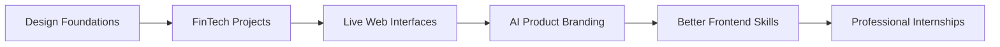

<!--
  ============================================================
  SYED ALI HADI — GITHUB PROFILE README
  Theme: Deep Royal Purple · Black · White
  Identity: FinTech × UI/UX × Graphic Design × AI Product Branding
  ============================================================
-->

<p align="center">
  https://capsule-render.vercel.app/api?type=venom&height=270&color=0:030014,35:240046,70:5A189A,100:C77DFF&text=Syed%20Ali%20Hadi&fontColor=FFFFFF&fontSize=56&animation=fadeIn&fontAlignY=38&desc=FinTech%20Student%20%E2%80%A2%20UI%2FUX%20Designer%20%E2%80%A2%20AI%20Product%20Branding&descSize=18&descAlignY=58
</p>

<!--
  Replace the banner above later with your Canva banner:
  <p align="center">
    YOUR_CANVA_BANNER_LINK
  </p>
-->

<h2 align="center">Designing Digital Finance With Clarity, Structure, and Visual Intelligence</h2>

<p align="center">
  <strong>BS Financial Technology @ FAST-NUCES Karachi</strong>
  <br/>
  <em>Turning financial, technical, and AI-powered ideas into clean, usable, and memorable digital experiences.</em>
</p>

<p align="center">
  
</p>

<p align="center">
  <a href="https://www.linkedin.com/in/syed-ali-hadi">
    
  </a>
  &nbsp;
  <a href="https://github.com/syed-ali-hadi">
    
  </a>
  &nbsp;
  <a href="mailto:syedalihadi5918@gmail.com">
    
  </a>
</p>

<p align="center">
  
  
  
</p>

<p align="center">
  
</p>

## 01. Identity

```txt
Name        : Syed Ali Hadi
University  : FAST-NUCES Karachi
Degree      : BS Financial Technology
Focus       : FinTech · UI/UX · Graphic Design · AI Product Branding
Approach    : Design-first thinking with technical execution
Current Kit : Figma · Adobe Suite · Python · C · GitHub · Netlify
```

I am a **Financial Technology student** with a strong creative side. My work combines **digital finance**, **UI/UX design**, **visual identity**, and **technology-driven product thinking**.

I like building things that are not just functional, but also:

- Clear to understand
- Clean to interact with
- Visually consistent
- Structured for real users
- Ready to move from concept to deployment

My goal is to grow as a creative FinTech builder who can understand both the **business logic** and the **user experience** behind digital products.

---

## 02. Core Direction

<div align="center">

<table>
<tr>
<td width="33%" align="center">

### 💸 FinTech

Budgeting tools  
Financial dashboards  
Digital finance workflows  
Secure transaction thinking  
Finance-first product ideas  

</td>
<td width="33%" align="center">

### 🎨 Design

UI/UX foundations  
Figma prototypes  
Visual identity systems  
Social media creatives  
Brand storytelling  

</td>
<td width="33%" align="center">

### ⚙️ Technology

Python fundamentals  
C programming  
GitHub workflows  
Netlify deployments  
Design-to-web handoff  

</td>
</tr>
</table>

</div>

---

## 03. About Me

I currently study **BS Financial Technology at FAST-NUCES Karachi**, where my academic direction connects finance with emerging technology.

My interests include:

```yaml
fintech_interests:
  - digital finance platforms
  - budgeting and expense tracking
  - financial dashboards
  - AI in financial products
  - blockchain-based systems
  - cloud-enabled financial tools
  - secure automated transactions

design_interests:
  - UI/UX design
  - product interfaces
  - brand identity
  - social media design
  - AI product visualization
  - landing page assets

technical_interests:
  - Python
  - C language
  - GitHub
  - Netlify
  - Figma-to-development workflows
```

I believe a strong product is created when **design, logic, trust, and usability** work together.

<p align="center">
  
</p>

## 04. Toolkit

### Design & Creative Tools

<p>
  
  
  
  
  
</p>

### Technical Tools

<p>
  
  
  
  
  
</p>

### Product & Domain Areas

<p>
  
  
  
  
  
</p>

---

## 05. Skill Matrix

<div align="center">

<table>
<tr>
<th>Area</th>
<th>What I Work On</th>
<th>Current Stage</th>
</tr>

<tr>
<td><strong>UI/UX Design</strong></td>
<td>User flows, wireframes, prototypes, interface structure</td>
<td>Growing Strong</td>
</tr>

<tr>
<td><strong>Graphic Design</strong></td>
<td>Brand visuals, social media assets, carousels, layouts</td>
<td>Professional Experience</td>
</tr>

<tr>
<td><strong>FinTech</strong></td>
<td>Budgeting tools, dashboards, digital finance concepts</td>
<td>Academic + Project Based</td>
</tr>

<tr>
<td><strong>Web Deployment</strong></td>
<td>GitHub repositories, Netlify hosting, live project workflows</td>
<td>Project Based</td>
</tr>

<tr>
<td><strong>Programming</strong></td>
<td>Python, C fundamentals, logic building</td>
<td>Actively Learning</td>
</tr>

</table>

</div>

<p align="center">
  
</p>

## 06. Featured Projects

<div align="center">

<a href="https://github.com/Syed-Ali-Hadi/Financialbudgetplanner">
  
</a>

<a href="https://github.com/Syed-Ali-Hadi/Bloodbankfinderapp">
  
</a>

</div>

---

### 💰 Financial Budget Planner

A university project focused on creating a public-facing financial planning interface.

**What this project includes:**

- Budget planning concept
- Income and expense comparison
- Visual dashboard thinking
- Figma-based interface planning
- Component-based design approach
- GitHub version control
- Netlify deployment workflow

**Why this project matters:**  
This project helped me understand how a finance idea can move from concept to interface, then from interface to a live hosted environment.

<p>
  <a href="https://github.com/Syed-Ali-Hadi/Financialbudgetplanner">
    
  </a>
</p>

---

### 🩸 Talash-e-Blood

A social-impact blood bank finder concept built around emergency access and donor discovery.

**What this project includes:**

- Donor registration flow
- Emergency request workflow
- Guided chatbot-style assistance concept
- Figma prototype planning
- Public-facing web interface
- GitHub and Netlify deployment process

**Why this project matters:**  
This project allowed me to work on a practical problem where user clarity, speed, and trust are extremely important.

<p>
  <a href="https://github.com/Syed-Ali-Hadi/Bloodbankfinderapp">
    
  </a>
</p>

---

## 07. Project Thinking Framework

Whenever I build or design something, I try to follow this structure:

```txt
01. Understand the problem
02. Define the user journey
03. Create the visual direction
04. Design the interface or assets
05. Build or prepare the structure
06. Deploy, test, and improve
```

For me, a project is not finished when it only looks good.  
A project becomes meaningful when it is **usable, understandable, and complete enough to be experienced**.

<p align="center">
  
</p>

## 08. Experience

<div align="center">

<table>
<tr>
<td width="50%" valign="top">

### Nexobe  
**Graphic Designer**

Worked remotely on digital branding and marketing visuals for multiple AI-driven platforms.

**Platforms:**

- Otteri
- Caviti
- Snap Photo
- Pikcel
- Vepery

**Work included:**

- Social media content
- Carousel designs
- Profile redesigns
- Landing page assets
- AI feature visualization
- Multi-platform visual identity support

</td>

<td width="50%" valign="top">

### Alkhidmat Karachi  
**Graphic Design Intern — Bano Qabil Program**

Worked on design fundamentals and practical creative workflows.

**Work included:**

- Vector graphics
- Branding assets
- Print media layouts
- Figma prototypes
- UI/UX fundamentals
- Design handoff preparation

</td>
</tr>
</table>

</div>

---

## 09. Design Case Focus

### AI Platform Branding

At Nexobe, I worked on visual assets for AI platforms across multiple product directions.

```txt
SaaS Automation       → Otteri
Healthcare Supply    → Caviti
Gen-AI Tools          → Snap Photo, Pikcel, Vepery
```

This helped me improve my ability to simplify complex AI features into visuals that users can understand quickly.

### Finance Interface Design

Through my university projects, I started exploring how financial tools should communicate information.

```txt
Charts        → make numbers understandable
Dashboards    → make decisions easier
User flows    → make tasks smoother
Visual design → make products trustworthy
```

<p align="center">
  
</p>

## 10. GitHub Dashboard

<p align="center">
  
</p>

<p align="center">
  
</p>

<p align="center">
  
</p>

<p align="center">
  
</p>

---

## 11. Recognition Board

<p align="center">
  
</p>

<p align="center">
  
</p>

## 12. Certifications & Achievements

```txt
▸ Certified Graphic Designer — Learning Resource Network
▸ Graphics Designing Essentials — Sindh Board of Technical Education
▸ Bano Qabil Certified Graphic Designer — Alkhidmat Karachi
▸ Graphic Designer Experience Certificate — Nexobe
▸ Ranked among Top 50 students across BIEK with A1 Grade
▸ PROCOM Esports Gaming Competition — Runner-up
▸ FSM Marketing Expo — Presented Talash-e-Blood Project
▸ ACM Team Guest Relations — Member
▸ PROCOM Startup Showdown — Participant
▸ PROCOM GR Tech Fest — Star Performer and Deputy
```

---

## 13. Learning Roadmap

<div align="center">

<table>
<tr>
<td width="25%" align="center">

### AI  
AI tools  
Prompting  
AI product flows  

</td>
<td width="25%" align="center">

### Blockchain  
Smart contracts  
Digital assets  
FinTech use cases  

</td>
<td width="25%" align="center">

### Cloud  
Deployment  
Scalable systems  
Product hosting  

</td>
<td width="25%" align="center">

### UI Engineering  
Frontend basics  
Design systems  
Interactive layouts  

</td>
</tr>
</table>

</div>

---

## 14. Current Roadmap



---

## 15. Personal Principles

```txt
Clarity over clutter.
Structure before decoration.
Design should reduce confusion.
Finance products should feel trustworthy.
Good visuals should explain, not distract.
A project should be shipped, not just imagined.
```

---

## 16. Open To

<p align="center">
  
  
  
  
  
</p>

I am open to:

- UI/UX internships
- Graphic design opportunities
- FinTech product collaborations
- AI product branding work
- University startup projects
- Hackathons and product-building teams
- Design-to-web learning opportunities

---

## 17. Connect With Me

<p align="center">
  <a href="https://www.linkedin.com/in/syed-ali-hadi">
    
  </a>
  &nbsp;
  <a href="mailto:syedalihadi5918@gmail.com">
    
  </a>
  &nbsp;
  <a href="https://github.com/syed-ali-hadi">
    
  </a>
</p>

<br/>

<h3 align="center">
  “I want to build digital experiences that make finance clearer, smarter, and more human.”
</h3>

<p align="center">
  <em>Thanks for visiting my profile. Let’s design, build, and ship something meaningful.</em>
</p>

<p align="center">
  
</p>
